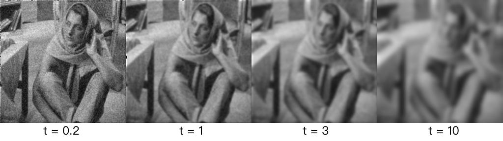

# 基于导热方程的图像去噪与锐化

XJTU “数学物理方程”课程 2023fall 的大作业代码。

本仓库储存了使用导热方程的解析解解法、数值解解法的代码实现。

## 快速开始指南

```shell
git clone https://github.com/yy4382/heat-denoise.git
cd heat-denoise

python -m venv venv

# Windows
venv\Scripts\activate
# Linux / macOS
source venv/bin/activate

pip install -r requirements.txt

python main.py
```

结果图存于 data/results 下

## 结论

使用代入解析解的方法时，对高斯噪音的效果相对较好（图一）由于计算机无法计算无穷级数，测试时级数累加至 10000。不够高的级数可能是丢失部分高频信息的原因。

使用迭代法时，对泊松噪音的效果较好（图二）

由于导热方程难以区分物体边缘和噪点，导致降噪后图片有不同程度模糊。当 t 增大时，模糊加剧。（图三）


$$
Gaussian\ noise\ params:\ mean=0,\ \sigma=0.08\\
PDE\  params:\ a=1,\ t=0.4
$$


$$
Poisson\ noise\ params:\ lam=35\\
PDE\ params:\ a=0.025,t=10^5
$$


